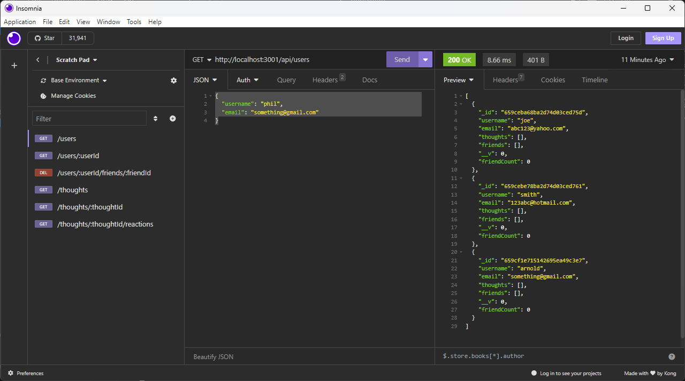

# socialAPI

## Description

this project was created to supply the backbone api for a social networking platform to help me familiarize myself with this type of application and api routes for it along with working with a noSQL database mongoose-db.

## Table of Contents

- [Installation](#installation)
- [Usage](#usage)
- [Credits](#credits)
- [License](#license)

## Installation

to install this project first clone the repo down to your device. you also must have node installed on your device and mongodb and a client to manipulate and view the program in such as insomnia. open the file in terminal and run npm install on the root folder. after that run node index.js and the program will boot up onto localhost on port 3001.

## Usage

to use this app once you have installed it and its dependancies you can manipulate the database using CRUD operations the paths are as follows:
* http://localhost:3001/api/users
    get: get list of users
    post: create new user

* http://localhost:3001/api/users/:userId
    get: get matching user
    put: update user info
    delete: delete user

* http://localhost:3001/api/users/userId/friends/:friendId
    post: add friend
    delete: remove friend

* http://localhost:3001/api/thoughts
    get: get all thoughts
    post: create new thought

* http://localhost:3001/api/thoughts/:thoughtId
    get: get matching thought
    put: update thought
    delete: delete thought

* http://localhost:3001/api/thoughts/:thoughtId/reactions
    post: create reaction
    delete: delete reaction

you can refer to models to see required values for json body to send for post requests, you can use theese routes to manipulate the database and in the future if wanted to create a frontend.

## Credits

This web application was created by Noah Lara. 
github : https://github.com/N-lara

I also give credit to the npm packages I used; express, mongoose, and date-and-time

## in progress

i am still working on all thought routes urrently only have user routes all finished and working good no video yet. soon.